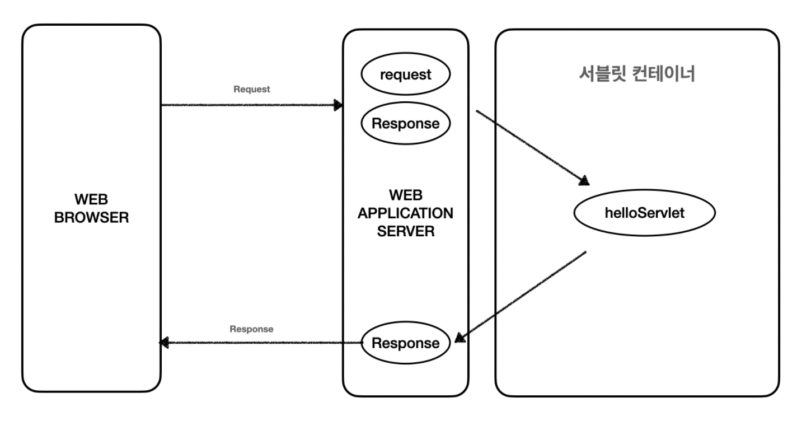

# 📌 서블릿
`Servlet`

`Java` 기반의 `Web Application Server`에서  
**클라이언트의 요청을 처리하고 그 결과를 반환**하기 위한 기술

웹 요청과 응답의 흐름을 간단하게 다룰 수 있게 해준다.

## 서블릿의 특징

### - 동적 처리
클라이언트의 요청에 대해 동적으로 작동

`WAS`는 정적인 처리를 담당하는 `Web Server`와  
동적인 처리를 담당하는 `Servlet Container`를 포함

### - 멀티스레딩
Java의 스레드를 이용하여 동작

#### 스레드 안전
멀티 스레딩 환경에서는 스레드 안전을 지키는 것이 중요하다.  
아래는 스레드 안전을 지키기 위한 방법이다.

- 전역 변수 사용 지양
- 객체의 불변 상태 유지
- 스레드 안전한 자료구조 활용

### - 보안성
서블릿은 다양한 보안 매커니즘을 적용할 수 있도록 설계되어 있다.

### - 컨트롤러
MVC 패턴에서 컨트롤러의 역할을 수행

.


# 📌 서블릿 컨테이너



Java 서블릿을 관리하는 웹 애플리케이션 서버의 핵심 구성 요소  
예: `Apache Tomcat`, `Jetty`

서블릿의 생명주기를 관리하고,
서블릿과 웹서버의 통신을 쉽게 만들어준다.

### 서블릿 생명주기 관리
**로딩** `Loading` : 서블릿 클래스 파일을 로드하여, 메모리에 인스턴스화  
**초기화** `Initialization` : 서블릿을 초기화  
**서비스** `Service` : 클라이언트의 요청마다 새로운 스레드를 생성하고, 적절한 메서드 호출 (`doGet()`, `doPost()`, ...)  
**해제** `Destruction` : 서블릿 인스턴스를 메모리에서 해제하기 전 정리 작업  

### HTTP 요청 처리
클라이언트로부터 온 HTTP 요청을 분석하고, 적절한 서블릿에게 전달하여 처리한다.

### HTTP 응답 생성
서블릿이 생성한 동적인 콘텐츠나 정적인 리소스를 사용하여 HTTP 응답을 생성한다.

### 스레드 관리
서블릿 컨테이너는 멀티스레딩을 지원한다. 
각 요청에 대해 새로운 스레드를 생성하여 서블릿을 실행하고, 요청을 동시에 처리한다.

### 세션 관리
서블릿 컨테이너는 클라이언트와 서버 간의 세션을 관리한다.
세션 식별자를 사용하여 클라이언트의 상태를 유지하고 관리한다.

.

# 📌 활용

### DispatcherServlet
스프링 프레임워크를 사용하는 대부분의 웹 애플리케이션이 사용하는 서블릿  

**스프링 부트**는 내부적으로 `DispatcherServlet`이 자동으로 설정되어,  
개발자가 서블릿을 직접 관리할 필요 없이 효율적으로 웹 요청을 처리한다.

클래스에 `@Controller` 어노테이션을 명시하면,  
스프링은 해당 클래스를 웹 요청을 처리하는 컨트롤러로 인식한다.

개발자는 각 HTTP 요청에 대응하는 메서드를 아래와 같이 구현하기만 하면 된다.


```java
@RestController
@RequestMapping("/example")
public class ExampleController {

    @PostMapping("/ex1")
    public String processRequest(@RequestBody DataObject data) {
        String result = "Received data: " + data.toString();
        return result;
    }
}
```

### @RequestBody
`클라이언트` -> `서버` 요청  
`json` 기반의 `Http Body`를 `Java` 객체로 변환  

`POST`, `PUT`, `PATCH` 요청에 사용된다.  

### @ResponseBody
`서버` -> `클라이언트` 응답  
`Java` 객체를 `json` 기반의 `Http Body`로 변환

### @RestController
`RESTful` 웹 서비스를 개발할 때 사용되는 어노테이션  
`@Controller`와 `@ResponseBody` 어노테이션의 결합  
반환값에 명시하지 않아도 자동으로 `@ResponseBody`가 붙어 반환된다.