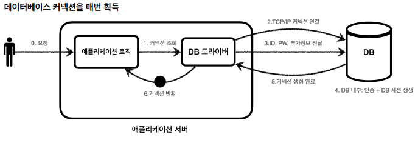
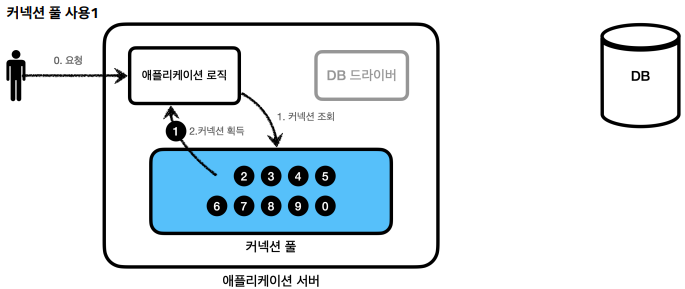
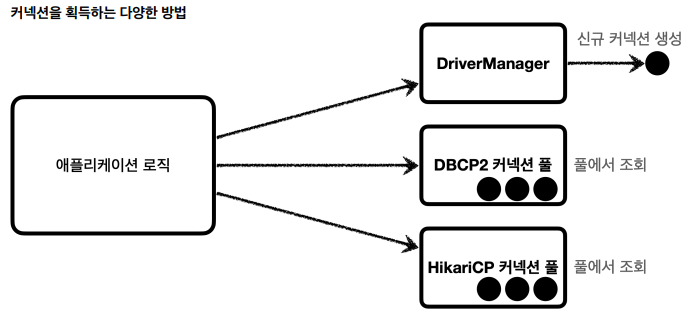
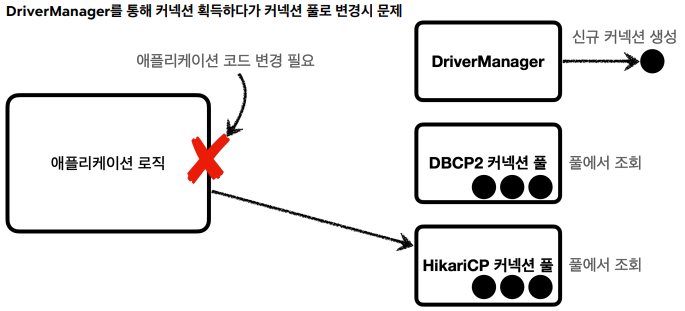
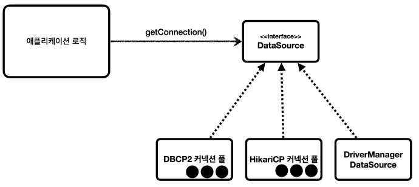

## 커넥션 풀



- 데이터베이스 커넥션을 획득할 때는 다음과 같은 복잡한 과정을 거친다. 
  1. DB 드라이버를 통해 커넥션 조회
  2. DB와 TCP/IP 커넥션을 연결
  3. DB에 ID, PW와 기타 부가정보를 전달
  4. ID, PW를 통해 내부 인증을 완료하고, 내부에 DB 세션을 생성
  5. DB 커넥션 생성이 완료되었다는 응답을 보냄
  6. DB 드라이버는 커넥션 객체를 생성해서 클라이언트에 반환

이렇게 커넥션을 새로 만드는 과정은 복잡하고 시간도 많이 소모되는 일이다. 
고객이 애플리케이션을 사용할 때, SQL 을 실행하는 시간 뿐만 아니라 커넥션을 새로 만드는 시간이 추가되어 결과적으로 응답속도에 영향을 주게 된다. 

이런 문제를 해결할 수 있는 아이디어가 커넥션을 미리 생성해두고 사용하는 커넥션 풀이라는 방법이다. 



- 애플리케이션을 시작하는 시점에 커넥션을 미리 확보해서 풀에 보관한다. 
- DB 드라이버를 통해 새로운 커넥션을 획득하는 것이 아니다. 
- 커넥션 풀에 이미 생성되어 있는 커넥션을 객체 참조로 가져다 쓰기만 하면 된다. 
- 이런 커넥션 풀에서 얻는 이점이 매우 크기 떄문에 실무에서는 항상 기본으로 사용한다. 
- 대표적으로 commons-dbcp2 , tomcat-jdbc pool , HikariCP 등이 있지만 최근에는 HikariCP 를 주로 사용한다. 

## DataSource 



- 커넥션을 얻는 방법은 JDBC Driver Manager 를 사용하거나, 커넥션 풀을 사용하는 등 다양한 방법이 존재한다. 



- Driver Manager 를 통해 커넥션을 획득하다가 커넥션 풀로 변경하게 되면 의존관계가 DriverManager 에서 HikariCP 로 변경되기 때문에 애플리케이션 코드도 함께 변경해야 한다. 

```java
    private Connection getConnection() {
        return DBConnectionUtil.getConnection();
    }

    public static Connection getConnection() {
        try {
            //DriverManager.getConnection() 에서 커넥션을 받아 옴
            Connection connection = DriverManager.getConnection(URL, USERNAME, PASSWORD);
            log.info("get connection={}, class={}", connection, connection.getClass());
            return connection;
        } catch (SQLException e) {
            throw new IllegalStateException(e);
        }
    }
```



- 자바에서는 이런 문제를 해결하기 위해 DataSource 라는 인터페이스를 제공한다. 
- DriverManager 는 DataSource 인터페이스를 사용하지 않는다. 
- DataSource 인터페이스를 사용하지 않으면 커넥션 풀을 사용하도록 변경할 때 관련 코드를 전부 수정해야 한다.
- 이런 문제를 해결하기 위해 스프링은 DriverManager 도 DataSource 를 사용할 수 있도록 DriverManagerDataSource 라는 클래스를 제공한다. 

``` java 
@Slf4j
public class ConnectionTest {

    //DriverManager 에서 커넥션을 받아 옴
    @Test
    void driverManager() throws SQLException {
        Connection con1 = DriverManager.getConnection(URL, USERNAME, PASSWORD);
        Connection con2 = DriverManager.getConnection(URL, USERNAME, PASSWORD);
        log.info("connection={}, class={}", con1, con1.getClass());
        log.info("connection={}, class={}", con2, con2.getClass());
    }

    //DrivermanagerDataSource 에서 커넥션을 받아 옴
    @Test
    void dataSourceDriverManager() throws SQLException {
        //DriverManagerDataSource - 항상 새로운 커넥션을 획득
        DriverManagerDataSource dataSource = new DriverManagerDataSource(URL, USERNAME, PASSWORD);
        useDataSource(dataSource);
    }

        private void useDataSource(DataSource dataSource) throws SQLException {
        Connection con1 = dataSource.getConnection();
        Connection con2 = dataSource.getConnection();
        log.info("connection={}, class={}", con1, con1.getClass());
        log.info("connection={}, class={}", con2, con2.getClass());
    }
}
```

- DriverManager는 커넥션을 획득할 때 마다 URL, USERNAME, PASSWORD 같은 파라미터를 매번 넘겨주어야 한다.
- DataSource를 사용하는 방식은 처음 객체를 생성할 때만 필요한 파라미터를 넘기고, 커넥션을 획득할 때는 단순히 dataSource.getConnection() 만 호출하면 된다. 

### 설정과 사용의 분리

- 설정: DataSource 를 만들고 URL, USERNAME, PASSWORD 같은 부분이 한 곳에 있는 것이 향후 변경에 더 유연하게 대처할 수 있다. 
- 사용: 설정은 신경쓰지 않고, dateSource.getConnection() 만 호출해서 사용하면 된다. 

### 설정과 사용의 분리로 얻는 이점
- 설정에 필요한 데이터를 DataSource가 만들어지는 시점에 미리 넣어두게 되면, DataSource를 사용하는 곳에서는 getConnection() 만 호출하면 되므로, URL, PASSWORD 와 같은 속성에 의존하지 않아도 된다. 
- 쉽게 말해 리포지토리는 DataSource만 의존하고 이런 속성을 몰라도 된다. 

```java 
    //MemberRepositoryV0 - getConnection() 
    private Connection getConnection() {
        return DBConnectionUtil.getConnection();
    }

    //DBConnectionUtil
    public static Connection getConnection() {
    try {
        Connection connection = DriverManager.getConnection(URL, USERNAME, PASSWORD);
        log.info("get connection={}, class={}", connection, connection.getClass());
        return connection;
    } catch (SQLException e) {
            throw new IllegalStateException(e);
    }
    }

    //MemberRepositoryV1 - getConnection() 
    private Connection getConnection() throws SQLException {
    Connection con = dataSource.getConnection();
    log.info("get connection={}, class={}", con, con.getClass());
    return con;
    }
```

``` java
    @BeforeEach
    void beforeEach() {
        //DriverManagetDataSource
        DriverManagerDataSource dataSource = new DriverManagerDataSource(URL, USERNAME, PASSWORD);

        //커넥션 풀링
        //HikariDataSource
        HikariDataSource dataSource = new HikariDataSource();
        dataSource.setJdbcUrl(URL);
        dataSource.setUsername(USERNAME);
        dataSource.setPoolName(PASSWORD);

        //
        repository = new MemberRepositoryV1(dataSource);
    }
```

### DI
- DriverManagerDataSource -> HikariDataSource 로 변경해도 리포지토리의 코드는 전혀 변경하지 않아도 된다. 리포지토리는 DataSource 인터페이스에만 의존하기 때문이다. 이것이 DataSource를 사용하는 장점이다. 